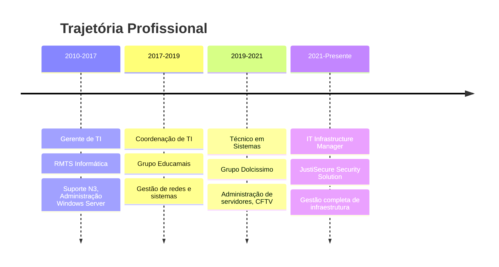

# 👋 Olá! Eu sou Elvis Almeida

## 🚀 IT Infrastructure Manager | Network & Security Specialist

Com mais de **15 anos de experiência** em administração de redes, gestão de infraestrutura de TI e suporte técnico. Apaixonado por tecnologia, dedicado a garantir que sistemas e redes funcionem de maneira **segura, eficiente e ininterrupta**.

### 💼 Atualmente
- **IT Infrastructure Manager** na JustiSecure Security Solution
- Cursando **Tecnólogo em Redes** na Impacta Tecnologia
- Desenvolvendo soluções inovadoras para otimização de infraestrutura

---

## 🛠️ Stack Tecnológico

### 💻 Infraestrutura & Virtualização

### 🔒 Segurança & Redes

### ☁️ Cloud & Monitoramento

### 🔧 Ferramentas & Automação

---

## 🏆 Projeto em Destaque

### 🔐 **Omega Password Portal**
> Solução web desenvolvida para permitir que usuários em home office possam trocar suas senhas do Active Directory de forma segura e autônoma

**Principais Características:**
- 🌐 Interface web responsiva com tema claro/escuro
- 🔄 Suporte completo para senhas expiradas
- 📱 Notificações via WhatsApp para administradores
- ☁️ Sincronização automática com Azure AD (Delta Sync)
- 📊 Sistema de logs detalhado com rotação automática
- 🛡️ Proteção contra força bruta e rate limiting

**Stack:** `Active Directory` `Azure AD` `Web Development` `Security` `API Integration`

---

## 📊 Experiência Profissional

---

## 🎯 Competências Principais

- ✅ **Virtualização:** VMware ESXi, Hyper-V, Docker
- ✅ **Segurança:** Firewalls (pfSense, FortiGate), VPN, Políticas de Segurança
- ✅ **Cloud:** Microsoft Azure, Office 365, Ambientes Híbridos
- ✅ **Backup & DR:** Veeam Backup, Planos de Continuidade
- ✅ **Redes:** Design, Implementação e Otimização
- ✅ **Monitoramento:** Zabbix, Análise de Performance
- ✅ **Automação:** Scripts PowerShell/Bash, Otimização de Processos

---

## 📈 GitHub Stats

  

---

## 🌟 Conquistas Recentes

- 🚀 Implementação de infraestrutura com **99.9% de uptime**
- 💰 Redução de **30% nos custos** de infraestrutura
- 👥 Migração bem-sucedida para Office 365 para **200+ usuários**
- 🔒 Zero incidentes de segurança nos últimos 2 anos

---

## 📚 Formação Acadêmica

- 🎓 **Tecnólogo em Redes de Computadores** - Impacta Tecnologia (2024-2027)
- 🎓 **Análise e Desenvolvimento de Sistemas** - Universidade Paulista (2019-2021)

---

## 💬 Vamos Conectar!

Estou sempre interessado em discutir novas oportunidades, projetos desafiadores e soluções inovadoras em infraestrutura de TI. 

📧 **Email:** [elvis@ebyte.net.br](mailto:elvis@ebyte.net.br)  
🌐 **Portfolio:** [ebyte.net.br](https://ebyte.net.br)  
💼 **LinkedIn:** [linkedin.com/in/elvisfalmeida](https://linkedin.com/in/elvisfalmeida)  
📱 **WhatsApp:** [+55 11 98397-8727](https://wa.me/5511983978727)

---

  
### "Transformando infraestrutura em soluções inteligentes" 🚀

